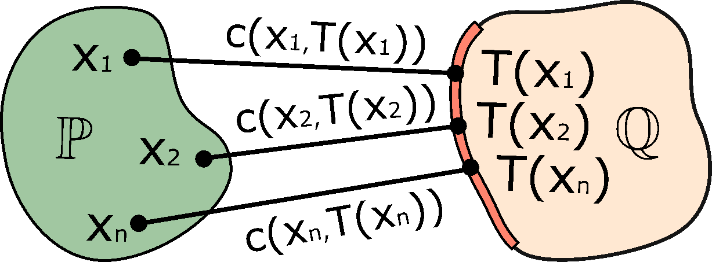
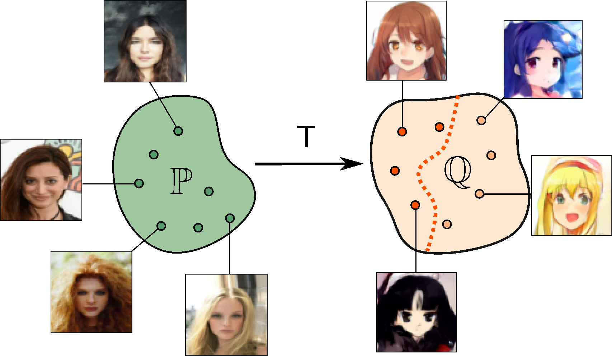

# Extremal Domain Translation with Neural Optimal Transport
This is the official `Python` implementation of the [NeurIPS 2023](https://nips.cc) paper **Extremal Domain Translation with Neural Optimal Transport** (paper [page](https://neurips.cc/virtual/2023/poster/70097) on NeurIPS) by [Milena Gazdieva](https://scholar.google.com/citations?user=h52_Zx8AAAAJ&hl=en), [Alexander Korotin](https://scholar.google.ru/citations?user=1rIIvjAAAAAJ&hl=en), [Daniil Selikhanovych](https://scholar.google.com/citations?user=ZpZhN3QAAAAJ&hl=en) and [Evgeny Burnaev](https://scholar.google.ru/citations?user=pCRdcOwAAAAJ&hl=ru).

The repository contains reproducible `PyTorch` source code for computing **incomplete transport** (IT) **maps** in high dimensions with neural networks. The algorithm can be used to partially align distributions or to **approximate extremal** (ET) **transport maps**. Examples are provided for toy problems (2D) and for the unpaired image-to-image translation task for various pairs of datasets.

<p align="center"></p>

<!-- ## Materials
- Vector \*.svg [sources](https://github.com/iamalexkorotin/KernelNeuralOptimalTransport/blob/main/pics/KNOT_figures.svg) of the figures in the paper (use [inkscape](https://inkscape.org/) to edit); -->

## Presentations
- [Talk](https://www.youtube.com/watch?v=2-vzNMMMWoI&t=2830s) by Milena Gazdieva at [Fall into ML conference](https://cs.hse.ru/ml2023/) (28 October 2023, EN)
<!-- - [Short Talk]() by Milena Gazdieva at [NeurIPS 2023]()(November 2023, EN) -->

## Related repositories
- [Repository](https://github.com/iamalexkorotin/NeuralOptimalTransport) for [Neural Optimal Transport](https://arxiv.org/abs/2201.12220) paper (ICLR 2023).

## Citation
```
@inproceedings{
    gazdieva2023extremal,
    title={Extremal Domain Translation with Neural Optimal Tansport},
    author={Gazdieva, Milena and Korotin, Alexander and Selikhanovych, Daniil and Burnaev, Evgeny},
    booktitle={Neural Information Processing and Systems},
    year={2023}
}
```

## Application to Unpaired Image-to-Image Translation Task
The unpaired domain translation task can be posed as a classic OT problem. The corresponding OT maps (or plans) *generally* preserve certain image attributes during the translation due to the problem nature. However, OT problem formulation leads to failures in certain cases, e.g., when the attributes of objects from source and target distributions are not balanced. 

Our IT algorithm could be used to resolve this issue. It searches for a transport map with the minimal transport cost (e.g., $\ell_{2}^2$) between source domain and the part ($\frac{1}{w}$) of the target domain which allows to **increase the similarity** between source and translated images. For the sufficiently large $w$, IT maps are fine approximations of ET maps which allow to achieve the **maximum similarity** between the source and translated images.
<p align="center"></p>

In contrast to the other popular image-to-image translation models based on GANs or diffusion models, our method provides the following key advantages
- it can be used to **control the similarity** between source and translated images ($w$);
- it is **theoretically justified**.

Qualitative examples are shown below for various pairs of datasets (at resolutions $64\times 64$ and $128\times 128$).

### Controlling the similarity
We test unpaired translation with XNOT with the $\ell_2^2$ cost on *celeba (female) → anime* ($64\times 64$), *handbags → shoes* ($128\times 128$), *texture → chairs* ($64\times 64$), *ffhq → comic faces* ($128\times 128$) datasets. Our method offers a single parameter $w\in[1,+\infty)$ to control the similarity between source and translated images.
<p align="center"></p>

## Repository structure
The implementation is GPU-based with the multi-GPU support. Tested with `torch==1.9.0` and 1-4 Tesla V100.

Toy experiments are issued in the form of pretty self-explanatory jupyter notebooks (`notebooks/`). For convenience, the majority of the evaluation output is preserved. Auxilary source code is moved to `.py` modules (`src/`). 
- ```XNOT_translation.py``` - unpaired image-to-image translation ($\ell_2^2$ cost);
- ```notebooks/XNOT_toy.ipynb``` - toy experiments in 2D (*Wi-Fi*, *Accept*);
- ```notebooks/XNOT_swiss2circle.ipynb``` - toy experiment with **analytically known** ET in 2D;
- ```notebooks/XNOT_limitations.ipynb``` - toy illustrations of limitations in 2D (*Diversity*, *Intersection*);
- ```notebooks/XNOT_kernel_cost.ipynb``` - toy experiment with **weak kernel cost** in 2D (**one-to-many**);
- ```notebooks/XNOT_test.ipynb``` - testing and plotting the translation results ([pre-trained models](https://github.com/milenagazdieva/ExtremalNeuralOptimalTransport/state_dicts/) are needed);
- ```stats/compute_stats.ipynb``` - pre-compute [InceptionV3](https://en.wikipedia.org/wiki/Inceptionv3) statistics to speed up test [FID](https://arxiv.org/abs/1706.08500) computation;

## Datasets
- [Aligned anime faces](https://www.kaggle.com/datasets/reitanaka/alignedanimefaces) (105GB) should be pre-processed with ```datasets/preprocess.ipynb```;
- [CelebA faces](https://mmlab.ie.cuhk.edu.hk/projects/CelebA.html) requires ```datasets/list_attr_celeba.ipynb```;
- Handbags, shoes [datasets](https://github.com/junyanz/iGAN/blob/master/train_dcgan/README.md);
- [Describable Textures Dataset](https://www.robots.ox.ac.uk/~vgg/data/dtd/) (DTD);
- [Flickr-Faces-HQ Dataset](https://github.com/NVlabs/ffhq-dataset/blob/master/README.md) (FFHQ);
- [Comic faces](https://www.kaggle.com/datasets/defileroff/comic-faces-paired-synthetic);
- [Bonn Furniture Styles Dataset](https://cvml.comp.nus.edu.sg/furniture/).

The dataloaders can be created by ```load_dataset``` function from ```src/tools.py```. The latter four datasets get loaded directly to RAM.

## Credits
- [Weights & Biases](https://wandb.ai) developer tools for machine learning;
- [pytorch-fid repo](https://github.com/mseitzer/pytorch-fid) to compute [FID](https://arxiv.org/abs/1706.08500) score;
- [UNet architecture](https://github.com/milesial/Pytorch-UNet) for transporter network;
- [ResNet architectures](https://github.com/harryliew/WGAN-QC) for generator and discriminator;
- [Inkscape](https://inkscape.org/) for the awesome editor for vector graphics.
